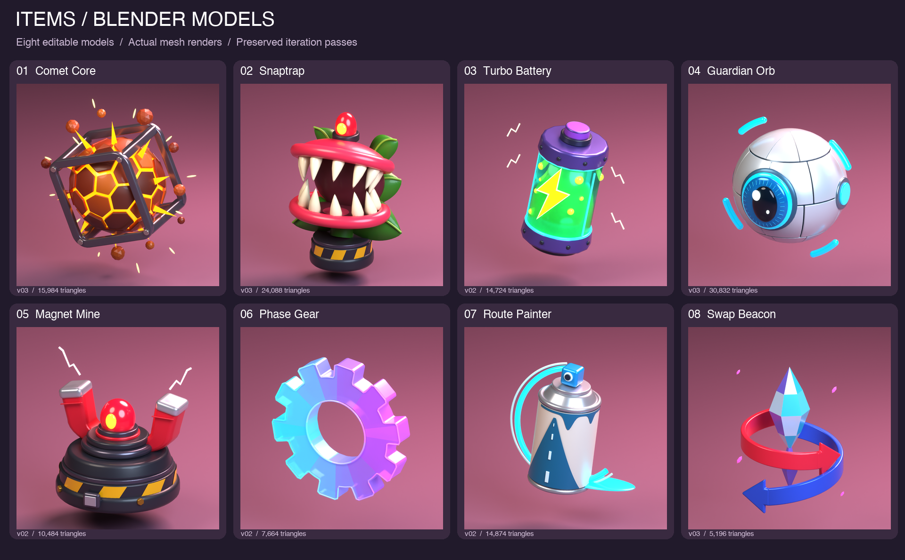

# Item models

Eight original Blender item models built one at a time from the [supplied concept sheet](../../concepts/items/item-concepts.png). Each item has two or three reviewed geometry passes, a clean editable source, a lit review scene, and UV-mapped FBX/GLB exchange assets.



[Concept-to-model comparison](concept-model-comparison.png) · [Validation results](validation.json)

| Item | Latest pass | Exchange triangles including effects | Blender source |
| --- | --- | ---: | --- |
| [Comet Core](comet-core/README.md) | 03 | 15,984 | [comet-core.blend](comet-core/comet-core.blend) |
| [Snaptrap](snaptrap/README.md) | 03 | 24,088 | [snaptrap.blend](snaptrap/snaptrap.blend) |
| [Turbo Battery](turbo-battery/README.md) | 02 | 14,724 | [turbo-battery.blend](turbo-battery/turbo-battery.blend) |
| [Guardian Orb](guardian-orb/README.md) | 03 | 30,832 | [guardian-orb.blend](guardian-orb/guardian-orb.blend) |
| [Magnet Mine](magnet-mine/README.md) | 02 | 10,484 | [magnet-mine.blend](magnet-mine/magnet-mine.blend) |
| [Phase Gear](phase-gear/README.md) | 02 | 7,664 | [phase-gear.blend](phase-gear/phase-gear.blend) |
| [Route Painter](route-painter/README.md) | 02 | 14,874 | [route-painter.blend](route-painter/route-painter.blend) |
| [Swap Beacon](swap-beacon/README.md) | 03 | 5,196 | [swap-beacon.blend](swap-beacon/swap-beacon.blend) |

## Editing and importing

The source scenes use meters, Z up, and −Y forward. `EXPORT` contains the editable item geometry, while `EFFECTS` contains removable sparks, orbit arcs, paint trails, or decorative crystal flecks. Camera, lights, floor, and packed concept art live in the separate review scene. Exchange files use Y up and consolidate geometry by material. Floating items export around their visual center; Snaptrap and Magnet Mine use the base origin. The exact source-to-export pivot offset is in each manifest.

All materials use portable constant PBR values. FBX material values are documented for explicit URP setup; GLB preserves its supported material properties, including emission/transmission extensions. Final previews use Standard color management at −1 EV to retain the saturated concept palette; earlier pass renders preserve their original lighting. The Blender review lighting and compositor glow are presentation settings, and need a runtime lighting/bloom setup to reproduce in Unity.

The models are static art assets for subsequent engine integration. They do not yet include Unity wrapper prefabs, colliders, item behavior, animation rigs, texture atlases, LODs, or a measured target-device performance budget. Source pieces remain editable, including Snaptrap's separate jaw assemblies. Rear surfaces and depth are inferred from the single supplied concept view. Appearance matching is a visual review, not a measured claim of identical reconstruction.

## Verification and rebuild

`tools/blender/build_items.py` generates and packages each item independently. `tools/blender/verify_items.py` freshly imports each FBX and checks geometry, UVs, counts, scale, and exclusion of studio objects; it also inspects GLB normals and UVs. All eight exchange packages passed. Unity appearance and gameplay are not tested.

```sh
"/Applications/Blender.app/Contents/MacOS/Blender" --background --factory-startup --python-exit-code 1 --python tools/blender/verify_items.py
```

`tools/blender/package_item_review.py` uses Pillow to assemble the contact sheets from actual renders. Per-item READMEs describe the visual corrections and link directly to source, exchange files, and front/rear views.
