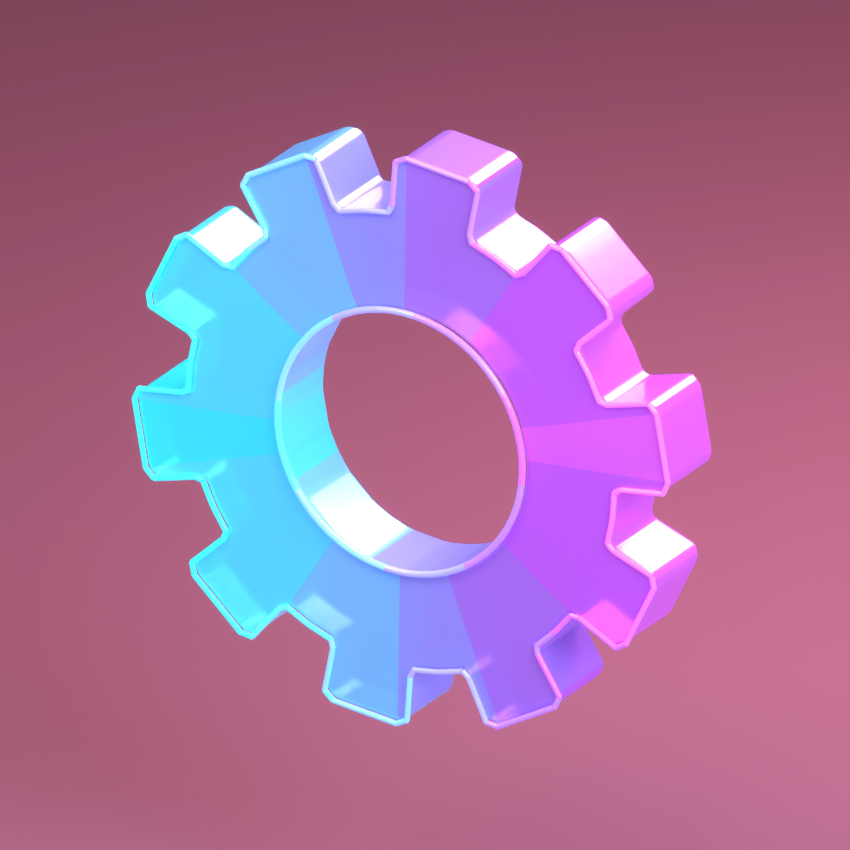

# Phase Gear

[Editable Blender model](phase-gear.blend) · [Lit review scene](phase-gear-review.blend) · [FBX](exports/phase-gear.fbx) · [GLB](exports/phase-gear.glb)



Two passes: ten-tooth open-center gear, softened tooth corners, cyan-to-violet material bands, translucent body, and separate luminous edge geometry.

[Front](review/final/front.png) · [Rear](review/final/rear.png) · [Concept](../../../concepts/items/phase-gear.png) · [Export validation](exports/validation.json)

The stable source preserves named editable parts in `EXPORT` and optional decorative effects in `EFFECTS`. Numbered `.blend` files and their `review/vXX` renders preserve the iteration history. The review scene has lighting, a camera, and the packed original concept sheet; these are excluded from exchange assets.

The exchange package has **7,664 triangles** across **8 material groups**, including optional effects. UVs, applied transforms, normals, mesh counts, dimensions, and studio exclusion are checked by the shared validator. Material colors use constant PBR values, without Blender-only procedural textures. GLB includes emission/transmission material extensions where used. FBX requires explicit URP materials; the material values and export pivot are recorded in [the manifest](exports/phase-gear.manifest.json).

This is a static item art asset. Source jaw and other component pieces can be edited independently; the exchange meshes consolidate by material and are not rigged. Runtime animation, colliders, LODs, shader effects, gameplay behavior, and Unity appearance are not implemented or tested here. Unseen rear surfaces are a consistent modeled interpretation of the supplied single-view concept.

Rebuild the current design with Blender 5.2.1 LTS:

```sh
"/Applications/Blender.app/Contents/MacOS/Blender" --background --factory-startup --python-exit-code 1 --python tools/blender/build_items.py -- --item phase-gear --revision 02 --final --views hero,front,rear
```

Choose a new revision number to preserve an existing source pass. The stable model, review scene, and exchange files are refreshed on final packaging.
