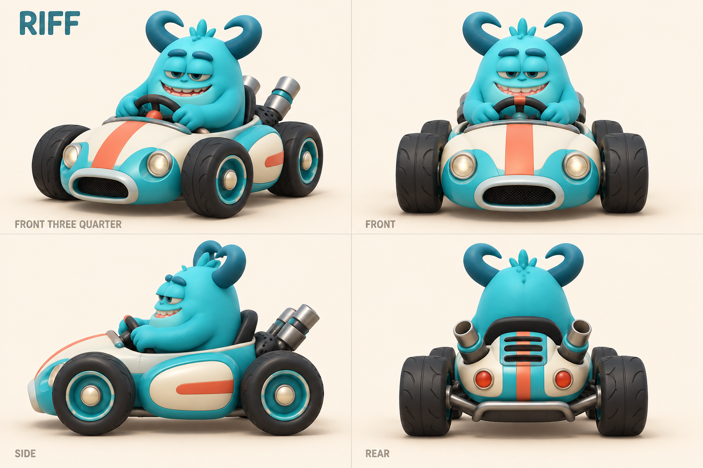
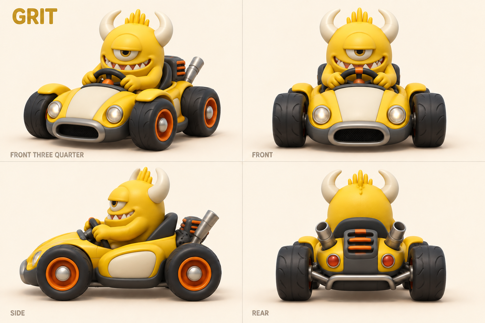
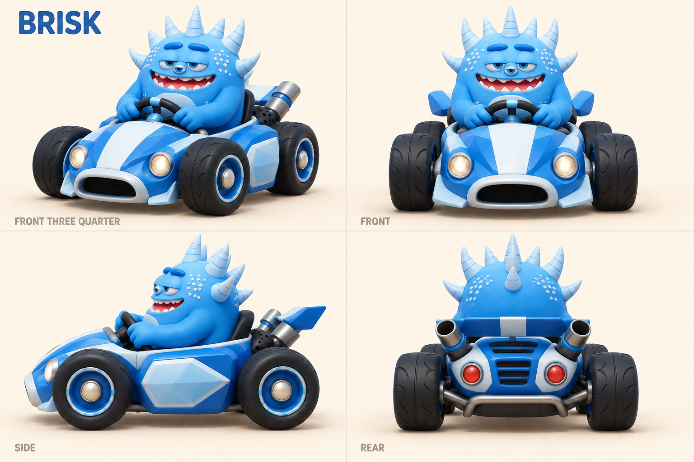
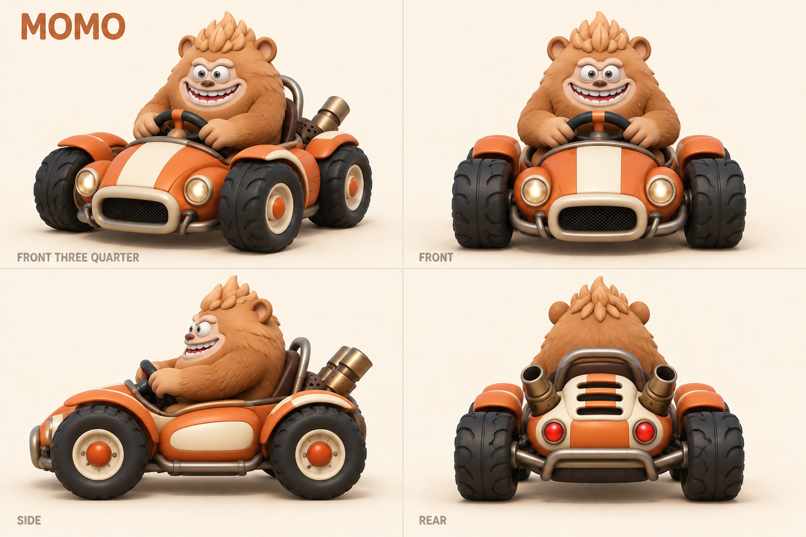
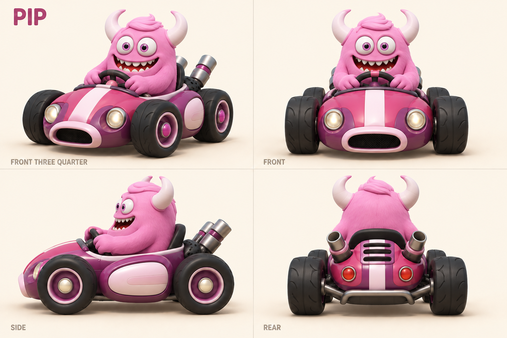
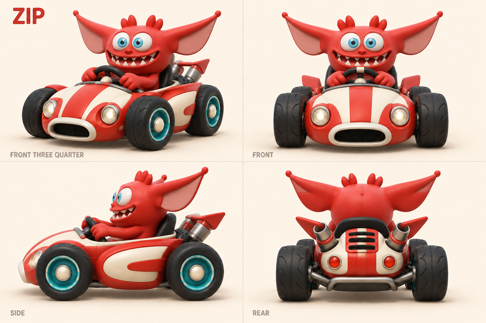
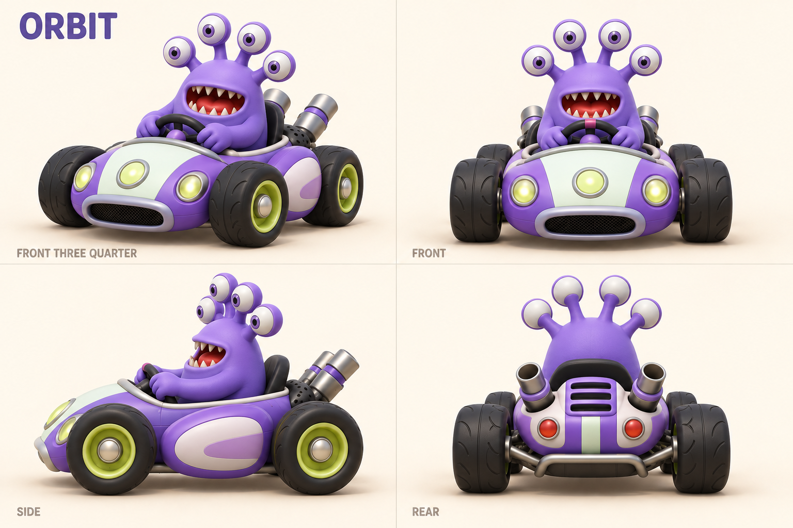
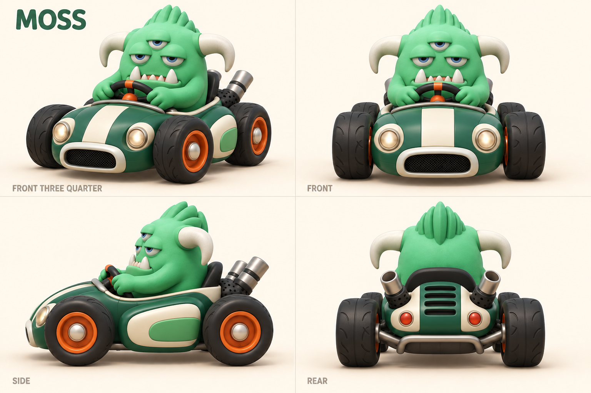

# Monster racers — concept round 01

**Archived first pass.** Character identities were liked; the vehicles were revised for stronger geometric variety. Use [round 02](../round-02/README.md) as the current kart direction.

Eight selected racers from the supplied twelve-monster reference. Every view keeps the monster seated in a four-wheel kart. Working names are for discussion, not final branding. Generated with the built-in `image_gen` tool on 2026-09-08; exact prompts are in [prompts.json](prompts.json).

These sheets establish appearance and provide modeling references. They are not exact orthographic blueprints: perspective, small trim details, and hidden geometry must be reconciled in Blender. No 3D racer meshes have been created in this round.

## Selected eight

Source positions refer to the [user-supplied lineup](../../../references/monsters/user-monster-lineup.png), counting left to right.

| ID / working name | Reference | Identity to preserve | Kart direction |
| --- | --- | --- | --- |
| 01 / Riff | Top row 1 | Teal body, two sleepy eyes, inward loop horns, cheeky grin | Cream/teal roadster with coral stripe |
| 02 / Grit | Top row 2 | Golden cyclops, ivory upward horns, short crest, triangular teeth | Yellow/graphite buggy with orange hubs |
| 03 / Brisk | Top row 3 | Blue body, three eyes, pale spike crown, pale belly | Cobalt/glacier kart with sculpted ice-like panels |
| 04 / Momo | Top row 4 | Caramel fur, two eyes, round ears, quiff, broad grin | Wide orange/cream off-road kart |
| 05 / Pip | Bottom row 1 | Pink body, two round eyes, swept fringe, ivory horns | Raspberry/plum roadster with pale pink details |
| 06 / Zip | Bottom row 3 | Red body, two blue eyes, huge wing-like ears, little head crest | Scarlet/cream kart with swept accents |
| 07 / Orbit | Bottom row 5 | Purple body, four stalk eyes, small toothy mouth | Violet kart with mint panels and lime hubs |
| 08 / Moss | Bottom row 6 | Green body, three sleepy eyes, long downward-ended horns, crest | Deep green/cream power kart with orange hubs |

## Full roster intent

The target roster remains **twelve little monster racers, always in vehicles**. This first art batch develops eight. Reserve the four other source monsters for the next round:

- 09: top row 5 — green upright two-eyed monster with large mouth.
- 10: top row 6 — violet rounded horned monster with clustered small eyes.
- 11: bottom row 2 — lime-green spiked monster with pale belly.
- 12: bottom row 4 — yellow three-eyed monster with small white horns.

The first eight were selected for contrasting silhouettes, eye arrangements, surface treatment, and color. The remaining four should be developed with equally recognizable rear silhouettes and kart details so all twelve read clearly during a race.

## Sheets

### Riff

### Grit

### Brisk

### Momo

### Pip

### Zip

### Orbit

### Moss

## Modeling handoff

Use [modeling-notes.md](modeling-notes.md) for scale, component separation, seated rigs, and the path into Unity. Store subsequent revisions as `*-v2.png`; preserve these initial references.
