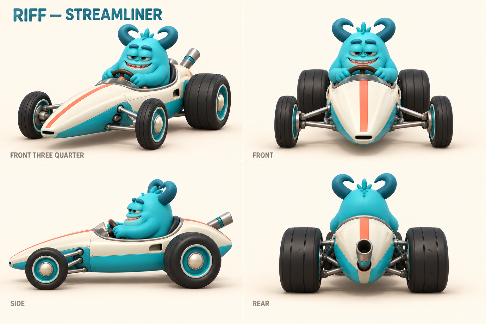
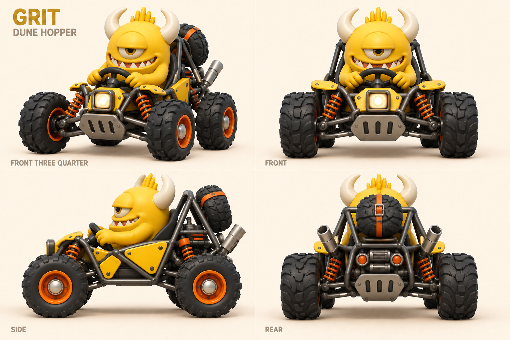
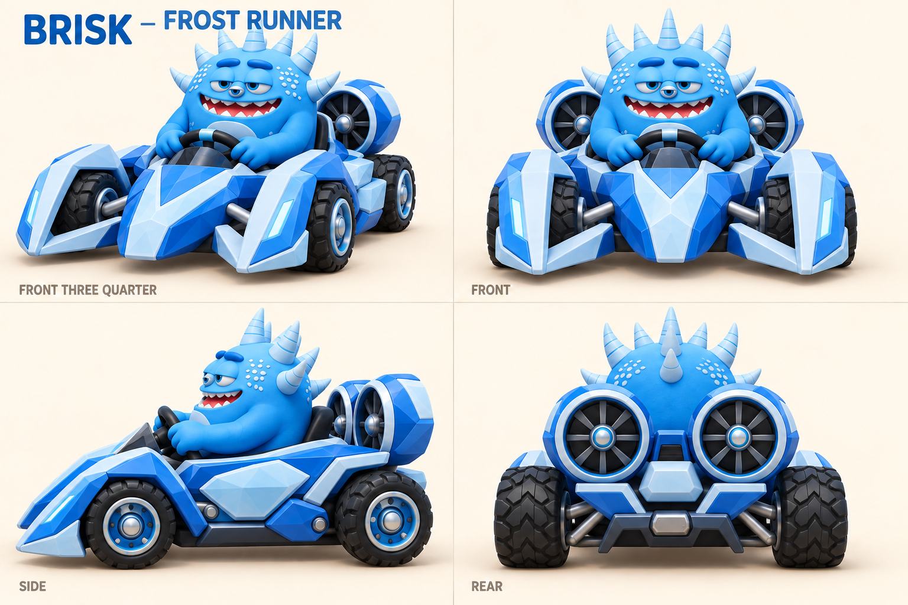
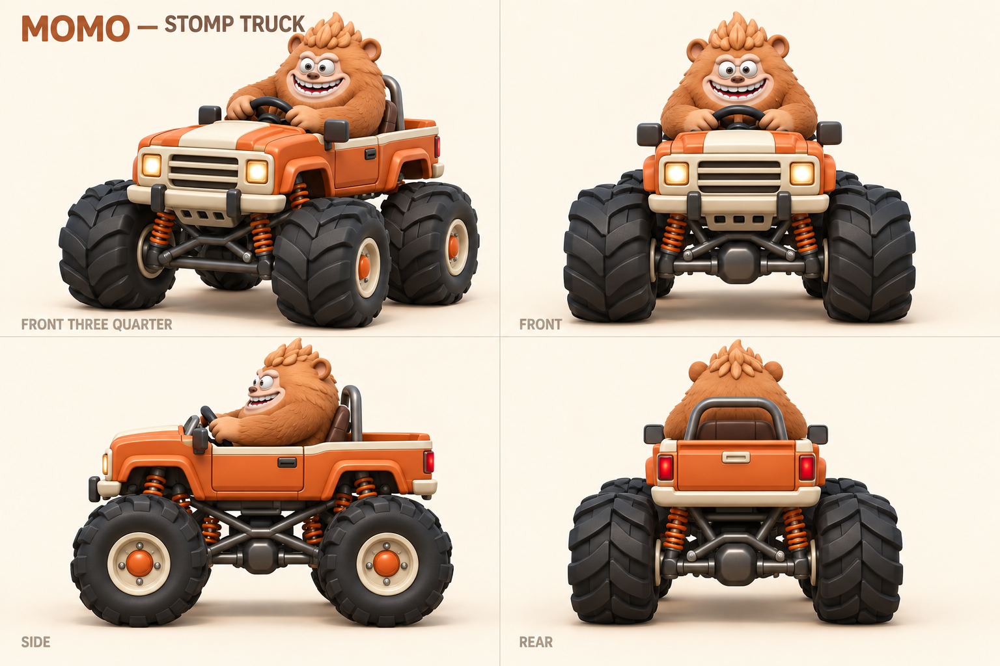
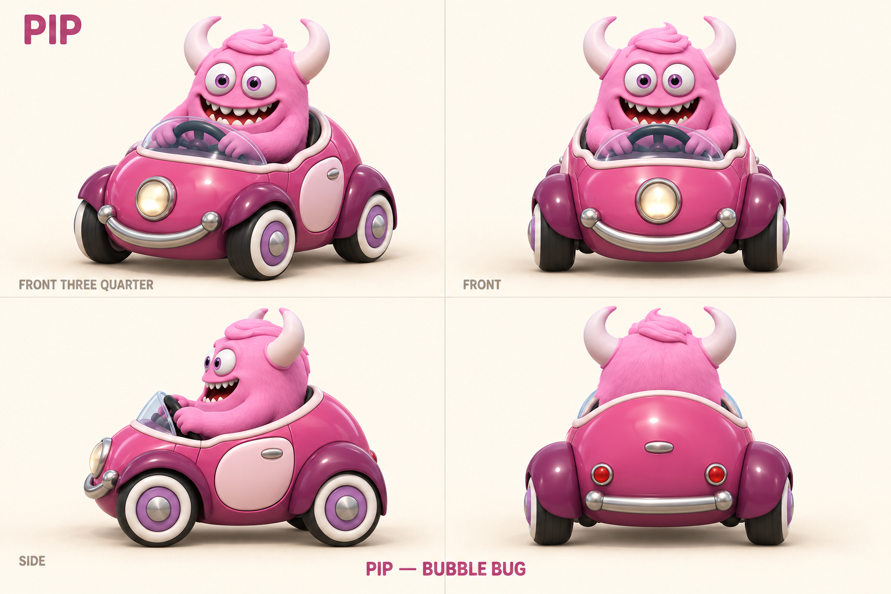
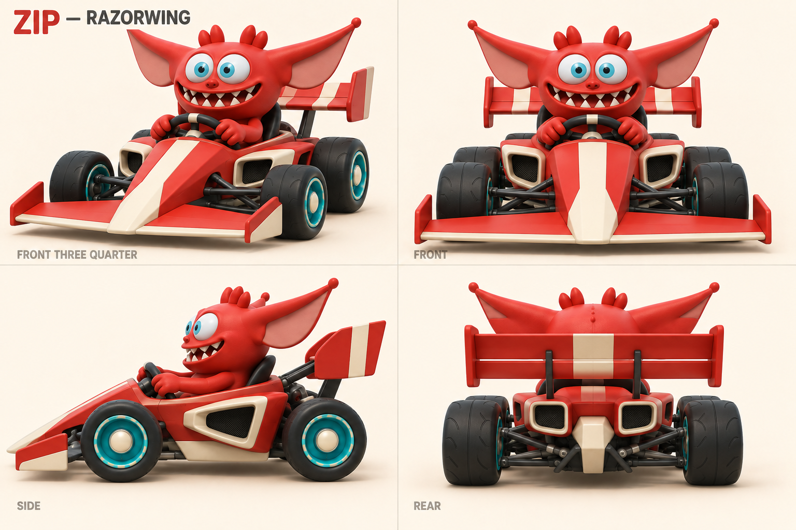
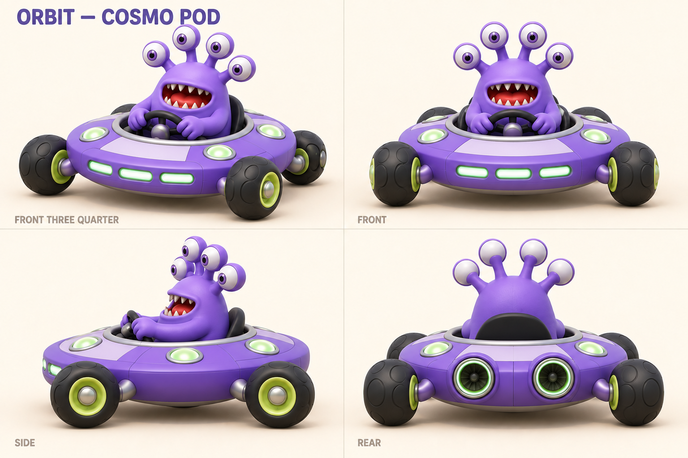
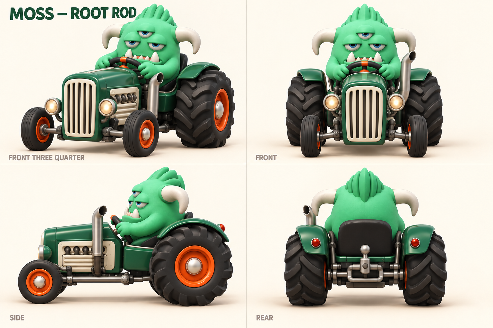

# Monster racers — distinct kart designs

The current concept direction. All eight approved monster identities stay; their vehicles now have different construction and silhouettes. Generated using the built-in `image_gen` tool. Exact edit prompts are in [prompts.json](prompts.json); each edit references the matching character sheet from [round 01](../round-01/README.md).

The first pass used one vehicle family too closely. This revision changes body shape, stance, wheel size, cockpit position and mechanical layout, while retaining a coherent polished cartoon finish. All racers stay seated inside their vehicles.

| Racer | Vehicle | Defining geometry |
| --- | --- | --- |
| Riff | Streamliner | Long torpedo nose, open front suspension, narrow front tires, boat tail |
| Grit | Dune Hopper | Skeletal tubular buggy, exposed coil springs, skid plate and spare tire |
| Brisk | Frost Runner | Wide forked sled-like nose, inset wheels and rear cooling fans |
| Momo | Stomp Truck | High pickup body, enormous tires and exposed lifted chassis |
| Pip | Bubble Bug | Short egg-shaped open microcar, rounded shell and partly enclosed small wheels |
| Zip | Razorwing | Low wedge, wide front wing, slick tires and tall rear aerofoil |
| Orbit | Cosmo Pod | Circular saucer body, recessed center cockpit and four outrigger wheels |
| Moss | Root Rod | Narrow upright tractor hood, small front tires and huge rear tires |

## Sheets

### Riff — Streamliner

### Grit — Dune Hopper

### Brisk — Frost Runner

### Momo — Stomp Truck

### Pip — Bubble Bug

### Zip — Razorwing

### Orbit — Cosmo Pod

### Moss — Root Rod

## Blender handoff

These are four-view visual concepts, not dimensionally exact blueprints. Reconcile minor differences between views in the actual 3D blockout. Preserve each vehicle's silhouette rather than fitting every design back onto the same visible chassis. All eight remain compact racing vehicles with four ground-contact wheels; Grit's carried spare is decorative.

Reuse technical interfaces: vehicle root, driver seat socket, steering input, four wheel pivots, VFX sockets and gameplay controller. Reuse small parts where suitable. **Do not require identical wheelbase, tire size, body shell, or suspension geometry.** Keep visible geometry independent of gameplay collision and tune fair contact envelopes intentionally.

Validate different ride heights, wheel radii, steering clearance, seated hands, suspension travel and chase-camera framing in graybox before final modeling. Decide whether visual differences imply handling differences through game design, not by assuming a monster-truck model must automatically dominate collisions. Body/driver animation guidance from [round 01](../round-01/modeling-notes.md) still applies; its shared-chassis recommendation is superseded by this revision.

The full roster target is twelve. The final four are now available in [round 03](../round-03/README.md). This delivery contains concepts only, not modeled or rigged racer assets.
