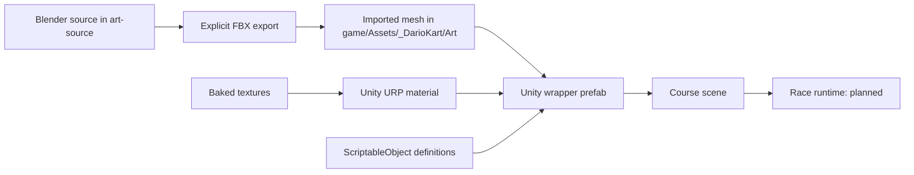

# Architecture and wiring

## What exists

Two assemblies: `DarioKart.Runtime` for game-facing code and `DarioKart.Editor` for editor tooling. The editor depends on runtime; runtime never imports `UnityEditor`. Four ScriptableObject types define karts, surfaces, items, and tracks. `SurfaceAuthoring` and `TrackAuthoring` attach content to world objects. These are contracts and authoring components; they do not implement driving or races.

`IKartInputSource` and `KartInputFrame` establish a shared input boundary. Keyboard, gamepad, AI, and the future phone adapter implement the same interface. The frame clamps controls and rejects non-finite axis values. Network transport, pairing, and device adapters are not implemented. See [phone integration](phone-controllers.md).

`Dario Kart → Setup Foundation` creates starter kart/surface data, URP settings, and an asset preview scene with a ramp prefab if its FBX export exists. It preserves existing assets and scenes. Imported models receive scale/normal/material import defaults. Materials and collision live on a Unity wrapper prefab, so re-exporting a mesh does not erase gameplay setup.

## Asset reference flow



Use serialized Unity references within content, not string searches or `Resources.Load`. Stable content IDs support future saves/catalogs; Unity `.meta` GUIDs maintain actual asset references. Do not rename IDs after saves depend on them. Keep editable source files outside `game/Assets` to avoid implicit Blender conversion on every machine.

## Planned gameplay modules

| Folder under Scripts/Runtime | Responsibility | Owns / consumes |
| --- | --- | --- |
| Core | Composition, loading, session lifecycle | Session settings; no giant global game manager |
| Karts | Ground probes, acceleration, steering, drift, boosts, air control, recovery | KartDefinition; input command; surface sample |
| Input | Keyboard/gamepad bindings and local player ownership | Produces the same command structure that AI will use |
| Racing | Countdown, ordered checkpoints, laps, position, finish, respawn | TrackDefinition and TrackAuthoring |
| Tracks | Track authoring and contact-surface resolution | SurfaceDefinition; colliders; authored markers |
| Items | Pickup, inventory, selection, firing, projectile and effect lifetimes | ItemDefinition; owner ID; hit effects |
| Obstacles | Moving gates, crushers, rotating bars, launch and boost pads | Authored path/phase, physics movement, trigger volumes |
| AI | Racing line, target speed, overtaking, recovery, item decisions | Track route; same kart commands as human player |
| Camera | Follow, look-ahead, speed FOV, jump framing, impact feedback | Kart presentation state |
| Presentation | Sound, particles, animation, UI feedback | Gameplay events; does not decide race results |
```

Implement modules as they become necessary. Do not add one abstraction/service per folder preemptively.

## Simulation rules to establish in the prototype

- Read player input per rendered frame; apply forces and resolve ground state at a fixed physics step. Start at 60 Hz with Rigidbody interpolation and evaluate collision detection at top speed.
- Ground probes resolve a `SurfaceAuthoring` on the hit collider or its parents. Missing profile means asphalt. Blend wheel/probe samples; avoid switching all handling abruptly when one wheel touches grass.
- `SurfaceDefinition` separates target speed, grip, and rolling resistance. Grass should pull speed down over time; it must not teleport the kart or instantly clamp launch velocity.
- Pads apply an explicit launch/boost event with a per-kart cooldown. Normal ramps work through geometry and velocity; air control and gravity must keep landing predictable.
- Dynamic solid hazards use physics-compatible movement; reserve animation-only transforms for cosmetic pieces. Telegraph a hazard before it closes a route.
- Checkpoint order gates lap completion. Respawn uses the last valid checkpoint and briefly protects the kart. AI uses the racing route, not a pedestrian NavMesh.
- Effects publish hit/boost/drift events for presentation. Avoid per-frame allocation and pool frequent projectiles and VFX when implemented.

## Scenes and prefabs

Planned composition: `Bootstrap` loads shared services, `MainMenu` selects a race, and one track scene loads additively for the race. Track scenes contain environment, lighting, grid positions, ordered checkpoints, item spawn markers, hazards, and recovery markers. Split a very large track into additive chunks only after memory profiling.

Karts: a stable gameplay root with Rigidbody/colliders and a separate visual child containing the Blender model, wheel/driver animation, VFX attachment points, and audio. Items: wrapper prefabs with effect/controller code and reusable art. Tracks: modular scenery plus unique road geometry, with collision simplified independently of the visible mesh.

`TrackDefinition.scenePath` is an explicit build-time scene path. `TrackAuthoring` holds references to that definition, a grid, checkpoints, and a racing line. Scene paths must be included in Build Profiles when races are implemented. This seed only provides an asset preview; it is not a race entry point.

## Verification strategy

Use EditMode tests for checkpoint ordering, lap progression, item selection constraints, and modifier lifetimes once those rules exist. Use PlayMode tests for respawn, pad re-entry, moving hazard collision, and track loading. Driving feel, readability, and frame pacing require hands-on play plus target-device profiling. A passing repository check alone says nothing about game feel or Unity compilation.
