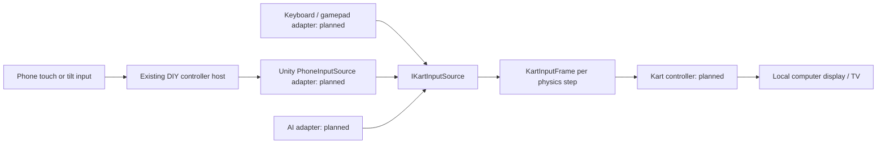

# DIY console and phone controllers

## Confirmed requirement

The game runs locally on Mac and Windows and eventually integrates into the user's existing DIY Nintendo Wii-style system, where phones are controllers. Keep the computer authoritative over all race simulation and rendering. A browser-based controller does not require the game itself to run in a browser.

The existing console's language, protocol, launcher, pairing flow, and controller implementation are not known yet. Reuse them once inspected; do not build a competing controller platform. The protocol below is a proposed integration boundary, not a claim about the existing system or a functioning transport.

## Connection architecture

Keep one source per local player slot. The kart never sees JSON, sockets, phone IDs, or browser events. Host/transport callbacks validate and enqueue messages; Unity's main thread consumes them. Network threads must not call Unity object APIs.

## Proposed adapter wire contract

If the existing system does not already define a transport, try LAN WebSockets first: simple browser integration and reliable messages. Avoid a required cloud relay. WebSocket transport has head-of-line latency tradeoffs; measure on the actual Wi-Fi before committing. If the existing system exposes virtual gamepads, use Unity Input System bindings instead of adding another socket layer.

Example input payload: [input-frame.example.json](../integrations/phone-controllers/input-frame.example.json).

| Field | Meaning |
| --- | --- |
| `version` | Protocol version, initially 1 |
| `sessionId` | Opaque session returned by pairing; example is a placeholder |
| `sequence` | Increasing integer within that paired session |
| `steer` | Normalized -1…1; smoothing/calibration happens in the adapter |
| `throttle`, `brake` | Independent 0…1 values |
| `driftHeld` | Current held state |
| `itemPressSequence` | Monotonic counter incremented per item button press |

Pairing assigns the session to a player slot on the host; never trust a client-supplied player index. Reject wrong sessions/versions, duplicate or old sequences, oversized payloads, and non-finite/out-of-range values. The first packet establishes the item counter baseline; a subsequent increase queues one item edge, never a burst of catch-up item uses. On reconnect reset session counters and button state.

Proposed send cadence: 30–60 Hz with rate limiting and a bounded latest-state queue. Keep axes/held states as the newest sample. Preserve item button edges separately until one physics tick consumes them; repeated packets must not retrigger an item. Do not extrapolate a stale throttle indefinitely.

Use host monotonic receive time for timeouts. Initial tuning proposal: neutral controls after 250 ms without a valid packet, mark disconnected after 2 seconds, show reconnect UI and apply the chosen pause/AI policy. These thresholds are starting values, not measured requirements. A browser that goes into the background must safely lose control rather than leave acceleration held.

## Phone UI and session flow

Join via the existing console's QR/code flow, choose a player, calibrate optional tilt, show ready status, then enter the race. Touch steering is the baseline; tilt is optional. Tilt sensor permission and secure-context requirements must be checked on actual iOS Safari and Android Chrome devices during the spike. Use large throttle, brake/drift, and item controls; don't require reading small text while watching the TV.

Reuse the console's launcher and focus/exit flow. Prefer a loopback connection between Unity and an existing local controller service when possible. Keep the phone-to-host session LAN-scoped and pair explicitly. Menu/back/pause controls are a separate UI input route, not kart throttle commands. Decide whether disconnect pauses the race, hands the kart to AI, or brakes safely before party play.

## Implementation order and acceptance

1. Inspect the existing DIY console protocol and launcher. Map its controls to the existing C# input contract; adjust this proposed wire format if needed.
2. Build keyboard/gamepad adapters and one kart. Keep the controls usable without a phone for development.
3. Connect one phone; test rapid taps, held drift, calibration, latency, duplicates, stale packets, sleep/background, and reconnect on Mac and Windows.
4. Add two local players with separate camera/HUD ownership. A single authoritative world runs once, while each extra camera adds rendering cost.
5. Profile the proposed maximum player count and actual Wi-Fi setup. More phone controllers do not require multiple networked copies of the game. Online multiplayer remains separate.

Record measured input-to-action latency and jitter under representative home Wi-Fi conditions. Do not assert a latency target has been met until tested on the actual phones and computers.
